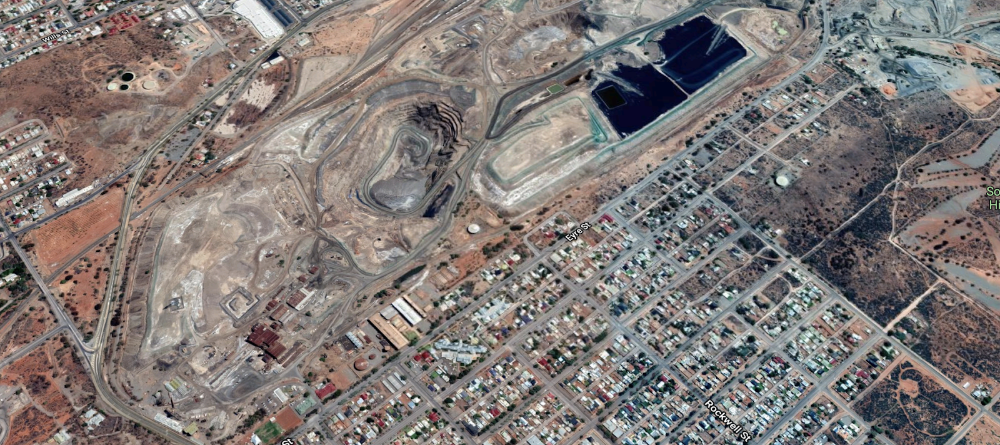
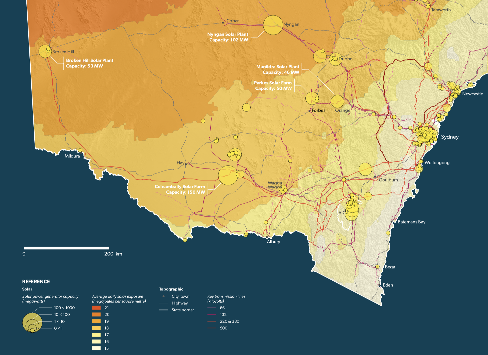
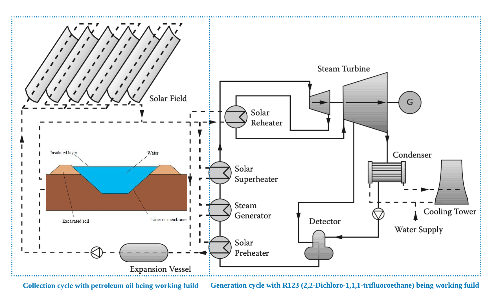
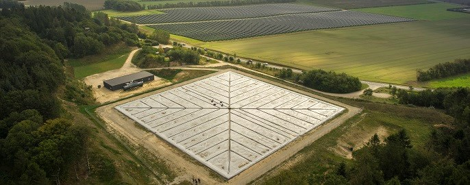

# Introduction to CSP and Thermal Storage

We have found that there are many open pits left from the mining industry, which is shown in figure 1. The pits have caused lots of damage to the local environment, and all land reclamation projects failed because of the high cost.

_Figure 1, satellite image of open pits left from mining industry in Broken Hill, NSW. There are many large open pits in the city center._

The solar radiation resource in Broken Hill has been utilized to generate electricity. There is a large solar PV power plant. Besides, the infrastructures for power transmission are well established. All the information is illustrated in figure 2. What we want to do is to further the Broken Hill's role as a solar power generation hot spot for NSW. A project to combine the concentrated solar power generation and thermal storage has been put forward to tackle the challenge of phasing out coal and mining industry.

_Figure 2, average daily solar exposure and distribution of solar generator capacity in NSW. Broken Hill is located in the top-left corner._

The project consists of two parts, thermal storage and power generation, which are illustrated in figure 3. The thermal storage system is a collection cycle composed of a solar field and a pit storage, and the working fluid is petroleum oil. The oil is heated to over 250 Celsius degree in solar field and can be directly stored in the pits. There is a series of heat exchangers to transfer the heat from collection cycle to the second part in the project, which is an organic Rankine cycle to generate electricity in relatively low temperature with R123 being the working fluid. It is called generation cycle. R123 is heated to steam phase by the heat from collection cycle. The steam turbine convert the heat power to the rotational power, which drives electricity generator to generates electricity. R123 is condensed to liquid phase through cooling tower and repeat the cycle. According to the condition in Broken Hill, the project is designed to be a daily storage system. That is, most of the heat is stored during the day and used to generate electricity during night. Seasonal storage can be introduced in the future to implement the shortage of solar radiation during winters.

_Figure 3, illustration of the thermal storage and power generation systems in project._

With income from powr generation, the mining industry can be phased out gradually in the future. The workers out of job because of industry upgrading can be re-employed in the power generation and device production industries. All in all, the future of Broken Hill can be illustrated imaginarily in figure 4.

_Figure 4, imaginary illustration of Broken Hill in the future._

## Return on Investment

A report from Australian Solar Thermal Research Initiative (<https://www.astri.org.au>) demonstrate a net present value analysis commissioned by CSIRO and undertaken by Deloitte Access Economics. The figure 5 shows a strong proposition for CSP with thermal storage over PV and batteries for levels of storage greater than three full load hrs.

_Figure 5, net present value analysis of concentrated solar power generation and thermal storage systems in Australia. Different lines represent performances of systems with different storage length. The systems with longer storage length needs more investment at the beginning, but they can get the return on investment sooner and more profit afterwards. It takes the CSP system without thermal storage 10 years, that is 5 years more, to recover all the investment._
