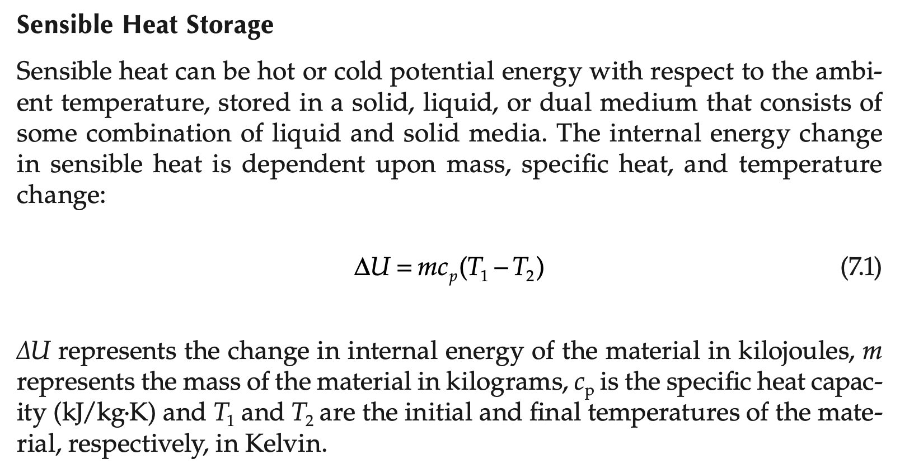
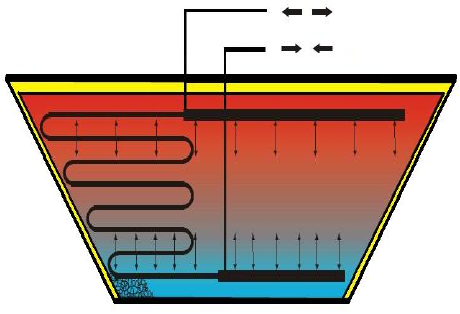
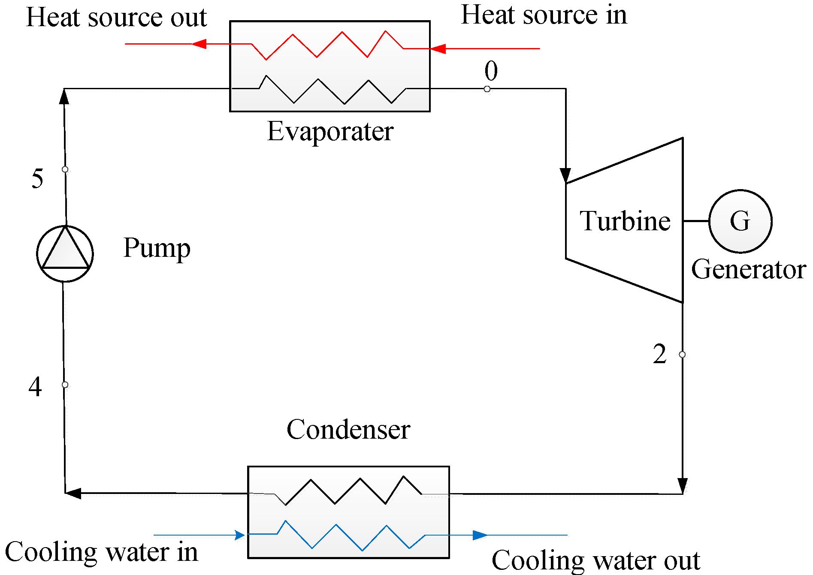

# Project for Energy and Sustainability

## 1, Introduction

In the whole project, you will select a geographical study area and develop a scenario and a plan for substantial improvements to the energy system and/or related sectors within this area. In addition, you will make a simplified sustainability assessment to determine how your proposed improvements may influence the sustainability of the assessed system.

The overall structure of the assignment:

1. Select a geographical area and a system for production of products or services within this area that you want to work with. This is called your reference case (see below).
2. Develop ideas for improvement of your reference case in a more sustainable direction
3. Present your reference case and your ideas in a Pitch competition
4. Based on your ideas and feedback from the pitch you should develop a future scenario for your system. You may use established methodologies for development of sustainable frameworks, or your own innovation processes. Make sure to relate your development to sustainability principles.
5. Compare your reference case and the scenario quantitatively and by means of indicators and present the work on a poster at a student poster conference.
6. Quantify potential improvements and possible drawbacks of your scenario compared to the reference case using simplified sustainability assessments in a life cycle perspective.
7. Present the results in a technical paper.

## 2, Reference Case

The reference case is how your investigated area and system looks today. The reference case is limited by various system boundaries, including geographical boundaries and system functions. A reference case can be e.g. “Tomato production in Tarragona 2018” or “Private heating of apartment buildings in east Berlin 2017”

- Electricity Generation in NSW 2019

## 3, Scenario

The scenario is a future version of the system described in the reference case. The scenario should be more sustainable than the reference case and should describe the most desirable future for this system that you can think of. The temporal scope of the scenario is an important parameter and should be included as an essential part of the study. For example, a scenario could be “Sustainable tomato production in Tarragona 2035”, “Private heating of apartment buildings in east Berlin 2050 using sustainable energy sources”, etc.

- NSW Zero-Coal Electricity System in 2030

## 4, Solution: CSP power generation and storage in Broken Hill

![Figure 1, options for Thermal Energy Storage in Solar Power Production. \[1\]](../images/1.png)

PE Foam with lots of bubble inside.

leca-stone

Direct storage

Floating insulation layer: The cover boards are floating on the surface.

Construct a dam using the soil taken from the pit.

reduce the vortex of water flowing in and out.

The inlet and outlet flows have a huge impact.

### Technical Advantages

- To use petroleum oil instead of water as the working fluid. Lower the burden of water supply in Australia.
- Existing heavy vehicles and facilities from the mining industry can be used.
- The pits caused by mining can be used as the storage pits.

### Pit Thermal Storage

### Organic Rankine Cycle

## 5, References

1. de Winter, F. 1990. Solar Collectors, Energy Storage, and Materials, MIT Press, Cambridge MA. With permission.
